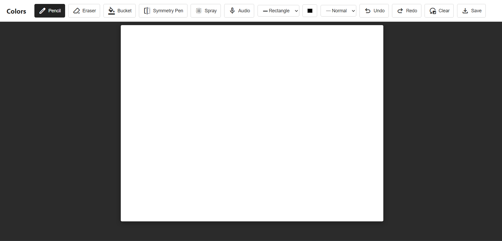
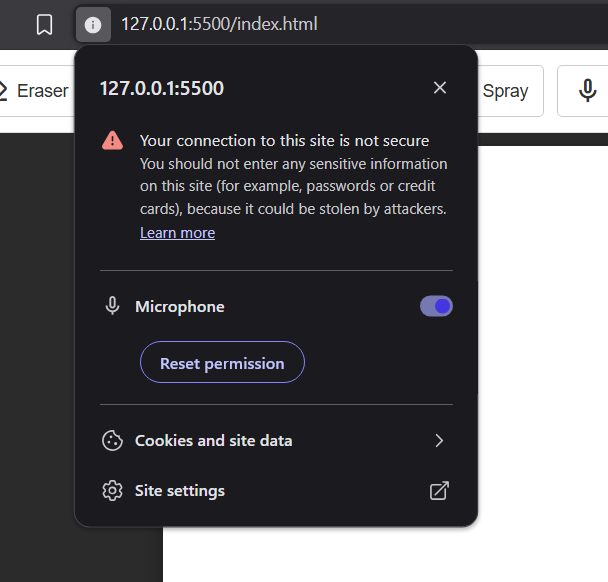

# Colors-Web Paint App

## Live demo: https://sooraj44882.github.io/paint/

## How to Run Locally
1. Clone or download this repository.
2. Ensure you have the `p5.js` library linked (or connected via CDN).
3. Open `index.html` in any modern web browser.

## Features

### Drawing Tools
* **Pencil:** with different size for drawing
* **Eraser:**  for erasing  
* **Paint Bucket:** fill closed areas with color
* **Symmetry Tool:** Draw mirrored designs
* **Spray Paint:** Add textured shading to your artwork
* **Shapes:** Draw geometric shapes like circle,triangle,square,rectangle
##

* **Audio Brush:** A unique tool that reacts to microphone input to change your brush size(please check first if you given permission and if it not works refresh page after permission)

##

* **Custom SVG Cursors:** The mouse pointer transforms into a Pencil, Eraser or Bucket based on your active tool.
* **Undo / Redo:** history tracking so you never lose your progress.(upto 10 version)
* Mobile-First Responsive UI 

##  Keyboard Shortcuts

Speed up your workflow with shortcuts

| Shortcut | Tool |
| --- | --- |
| `Ctrl + P` | Pencil |
| `Ctrl + E` | Eraser |
| `Ctrl + B` | Paint Bucket |
| `Ctrl + A` | Audio Brush |
| `Ctrl + Z` | Undo |
| `Ctrl + Shift + Z` | Redo |
| `Ctrl + S` | Save |

## Tech Stack
* **Frontend:** HTML5, CSS3, Vanilla JavaScript
* **Canvas Library:** [p5.js](https://p5js.org/)
* **Icons:** Google Material Symbols

